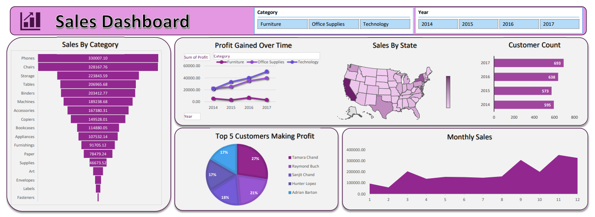

This project is a data visualization dashboard that provides insights into sales performance across multiple product categories and years (2014–2017). The dashboard helps users explore sales trends, profit growth, customer distribution, and geographic performance to better understand overall business performance over time.

## Project Overview

The Sales Dashboard presents comprehensive analytics on sales data, enabling users to:

- Identify sales performance by product category and sub-category  
- Analyze profit trends over multiple years  
- Track customer growth year-over-year  
- Understand geographic sales distribution by state  
- Identify top customers contributing to overall profit  
- Explore monthly sales patterns to detect seasonal trends  

The dashboard was built using **Power BI / Microsoft Excel**, leveraging interactive visuals, filters, and dynamic charts to provide an intuitive, data-driven experience.

## Dashboard Preview

## Data Sources

The dataset used in this project includes:

- Sales transaction data across multiple product categories  
- Profit data from 2014 to 2017  
- Customer-level data used for customer count and profit contribution  
- Monthly and yearly sales records  
- Geographic data for state-wise sales analysis  

## Key Metrics and KPIs

The dashboard tracks and visualizes several important business metrics, including:

- Sales by Category and Sub-Category  
- Profit Gained Over Time (2014–2017)  
- Customer Count by Year  
- Top 5 Customers Making Profit  
- Monthly Sales Trend  
- Sales by State (Geographic Analysis)  

## Dashboard Features

- Interactive filters for **Year** and **Category**  
- KPI-driven visualizations for quick performance assessment  
- Time-series analysis for profit and sales trends  
- Geographic map for state-level sales comparison  
- Customer-level analysis to identify high-value customers  
- Clean and business-friendly dashboard layout  

## Usage

1. Clone or download this repository  
2. Review the dashboard preview image for visual insights  
3. Use the dashboard to analyze sales performance, trends, and customer behavior  

 
